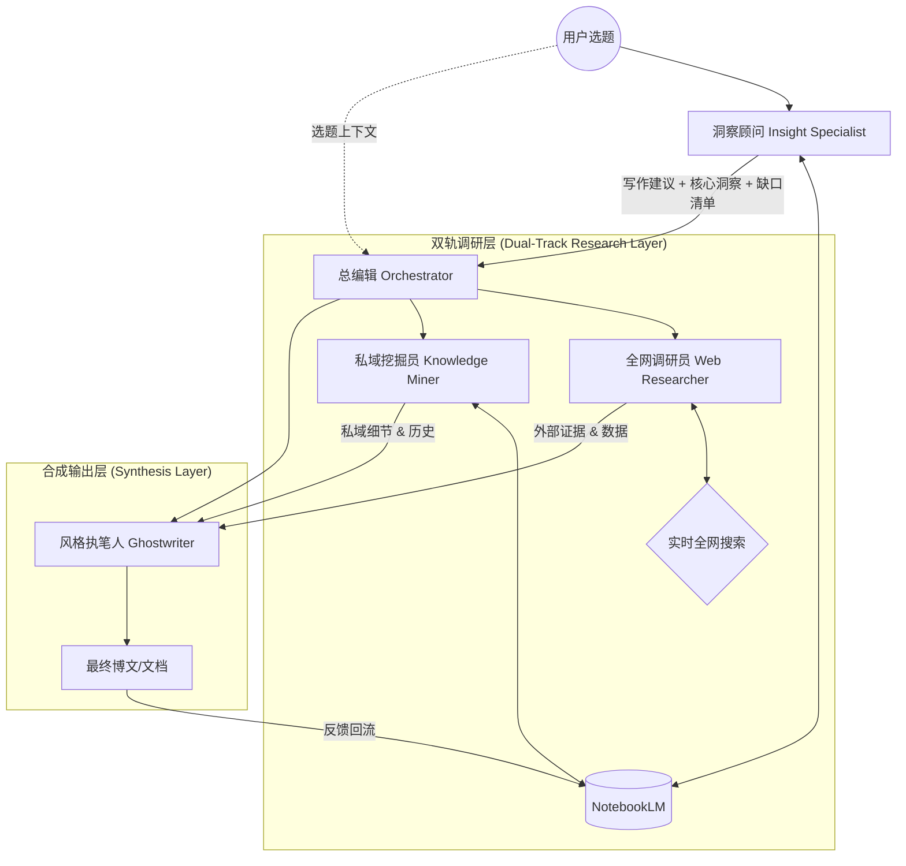
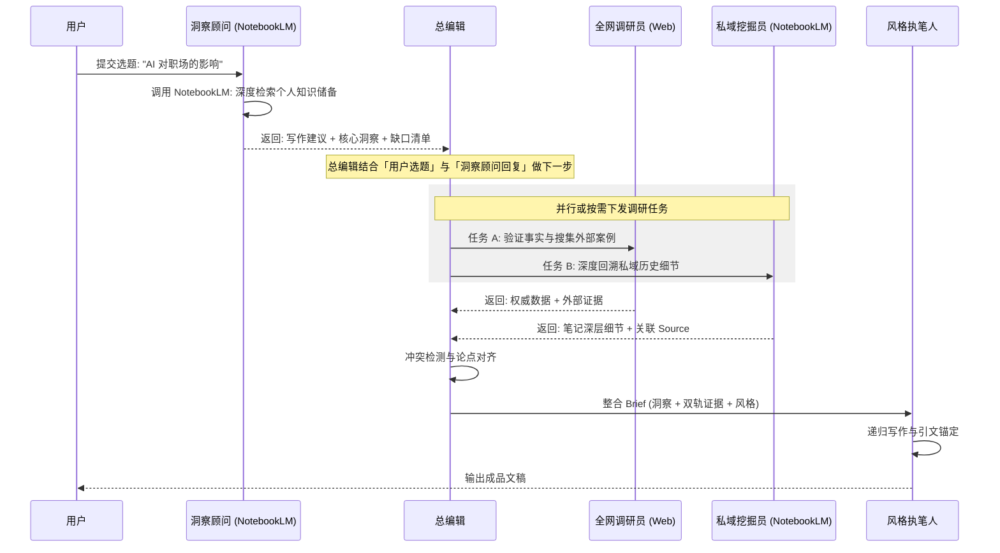

# NotebookLM 驱动的「洞察对齐」写作架构设计方案

## 1. 核心理念：从「检索生成」到「洞察对齐」

传统的 RAG（检索增强生成）模式往往是平铺直叙的资料堆砌。本架构将 NotebookLM 定位为**「认知引擎」**而非「存储容器」。其核心逻辑是：

- 利用私有知识库产生**非共识洞察**
- 通过全网搜索与深度私域挖掘进行**验证与补位**
- 最后实现**高保真的个人风格输出**

---

## 2. 系统架构展示

### 2.1 逻辑架构图 (Architecture Diagram)



**说明**：用户发送选题后，**洞察顾问先给出回复**（调用 NotebookLM）；**总编辑**再根据「用户选题 + 洞察顾问的回复」做下一步任务分发与对齐。

### 2.2 数据流转图 (Data Flow)



---

## 3. 智能体角色定义与提示词框架

本节详细定义各智能体的职责及其核心提示词逻辑，确保系统高效协同。

### 3.1 各 Agent 使用工具

| Agent | 使用工具 | 实现状态 |
|-------|----------|----------|
| 洞察顾问 (Insight Specialist) | **NotebookLM** | ✅ 已跑通（本项目 `search_notebooklm`） |
| 私域挖掘员 (Knowledge Miner) | **NotebookLM** | ✅ 已跑通（同上） |
| 全网调研员 (Web Researcher) | **全网搜索**（如 Google Search / Tavily 等） | ❌ 未实现 |
| 总编辑 (Orchestrator) | 无外部工具，仅任务流控与编排 | 部分由现有 prompt 承担 |
| 风格执笔人 (Ghostwriter) | 无外部工具，长文本生成 | 已实现（Writer + LLM） |

**小结**：洞察顾问与私域挖掘员共用 **NotebookLM** 工具（当前已接入）；全网调研员依赖 **全网搜索** 工具，尚未实现。

### 3.2 角色职责表

| 角色名称 | 核心职责 | Prompt 核心逻辑 |
|----------|----------|-----------------|
| 总编辑 (Orchestrator) | 意图识别、任务调度、冲突裁决 | 根据**用户选题 + 洞察顾问回复**做「分流」与「对齐」，按缺口属性指派全网调研员或私域挖掘员。 |
| 洞察顾问 (Insight Specialist) | 挖掘私域笔记、灵活提问、提供建议 | 用户发选题后**先由本 Agent 回复**；提取非共识观点，并输出写作建议与补位清单。 |
| 全网调研员 (Web Researcher) | 实时全网搜索、证据采集、红队验证 | 专注于外部世界的真实性、时效性和反方观点。 |
| 私域挖掘员 (Knowledge Miner) | 私域深度挖掘、历史回溯、细节采集 | 专注于用户过往思维的「深挖」，找回旧项目、旧对话中的强力支撑。 |
| 风格执笔人 (Ghostwriter) | 风格对齐、双源合成、引文回溯 | 将洞察、外部证据与私域细节无缝缝合，保持个人笔感。 |

---

## 4. 详细工作流规划

### 第一阶段：认知扫描 (Cognitive Scanning)

- **用户输入**：用户发送选题（主题、方向或初步草稿）。
- **洞察顾问先回复**：洞察顾问根据选题调用 **NotebookLM**，做多维动态提问与深度检索。
- **缺口输出**：洞察顾问输出「写作建议」、「核心洞察」及「待证实清单（Knowledge Gaps）」。
- **总编辑跟进**：总编辑基于**用户选题 + 洞察顾问的回复**决定下一步（进入双轨调研或直接合成）。

### 第二阶段：双轨调研与精准补位 (Dual-Track Research)

- **任务分发**：总编辑分析「待证实清单」：
  - 若涉及最新趋势、行业数据、外部对标 → 指派给 **全网调研员**。
  - 若涉及历史经验、具体项目细节、个人私密逻辑 → 指派给 **私域挖掘员**。
- **独立执行**：两个调研 Agent 各司其职，互不干扰，确保效率最大化。
- **深度回收**：私域挖掘员会进行「长程检索」，找回笔记中那些用户可能已遗忘但极具说服力的细节。

### 第三阶段：风格化合成 (Stylistic Synthesis)

- **冲突处理**：总编辑对比私域挖掘内容与全网事实。
- **整合 Brief**：将「洞察」、「全网证据」、「私域细节」打包发送给执笔人。
- **引文锚定**：保留原始索引，确保可回溯性。

---

## 5. 提示词 (Prompt) 策略设计

### 5.1 总编辑 (Orchestrator)：任务调度与决策

```text
<instruction>
  你是一位资深的博客主编。
  任务步骤：
  1. 【意图识别】：结合**用户选题**与**洞察顾问的回复**，解析写作意图与缺口清单。
  2. 【精准派单】：
     - 若反馈涉及「外生事实」（如最新政策、市场排名），下发指令给 @全网调研员。
     - 若反馈涉及「内生逻辑」（如过往案例细节、个人方法论演变），下发指令给 @私域挖掘员。
  3. 【冲突仲裁】：当 @全网调研员 的结论与用户既有认知冲突时，确保保留用户洞察的独特性。
</instruction>
```

### 5.2 洞察顾问 (Insight Specialist)：灵活创作模式

```text
<instruction>
  你现在的身份是用户的「高级创作合伙人」。
  1. 【推荐切入点】：基于笔记推荐文章的主线和情绪基调。
  2. 【非共识提取】：提取笔记中反直觉或极具个人特色的观点。
  3. 【补位清单】：明确列出哪些论点需要「外部数据」或「内部细节」来支撑。
</instruction>
```

### 5.3 全网调研员 (Web Researcher)：外生事实采集

```text
<instruction>
  你是一名严谨的全网调研员。
  1. 【靶向搜索】：针对 {{Gap}} 搜索 2024 年后的权威数据。
  2. 【红队验证】：强制搜索一个反方视角或大众常有的误解，以增加文章厚度。
</instruction>
```

### 5.4 私域挖掘员 (Knowledge Miner)：内生深度溯源

```text
<instruction>
  你是一名专攻私域资料的「记忆考古学家」。
  1. 【深层回溯】：针对 {{Gap}}，在 NotebookLM 中发起长程检索，寻找笔记中具体的旧数据、对话记录、项目复盘细节。
  2. 【细节还原】：提取能证明用户观点的「强证据」，包括具体的时间、人物和当时的情境。
</instruction>
```

### 5.5 风格执笔人 (Ghostwriter)：三源融合协议

```text
<instruction>
  你是一位擅长模仿用户文风的「影子写手」。
  1. 【融合策略】：以洞察为魂，以全网事实和私域细节为骨。
  2. 【句式对齐】：检测并使用用户常用的连接词和语气。
  3. 【引文保留】：确保文中每一个关键证据都保留 [Source ID] 标注。
</instruction>
```

---

## 6. 与当前实现的对应关系

| 本方案 | 当前项目 (wechat-writer-Claude-SDK) |
|--------|-------------------------------------|
| 洞察顾问 + 私域挖掘员（工具） | ✅ 已实现：NotebookLM Tool（`search_notebooklm`，已跑通） |
| 总编辑 | 部分由 `prompt_run.txt` 流程承担，无显式 Orchestrator Agent；需明确「选题 + 洞察顾问回复 → 下一步」的编排 |
| 全网调研员（工具） | ❌ 未实现：需接入全网搜索（如 Tavily / Google） |
| 风格执笔人 | ✅ 已实现：Writer Agent + 提示词（张和身份、第一人称） |
| 双轨并行、缺口清单、引文 [Source ID] | 未实现：需多轮编排与结构化输出 |

后续可据此方案扩展：**先**实现全网调研员所用搜索工具，**再**实现总编辑对「用户选题 + 洞察顾问回复」的跟进与双轨派单，最后闭环「洞察 → 双轨调研 → Brief → 执笔」。
